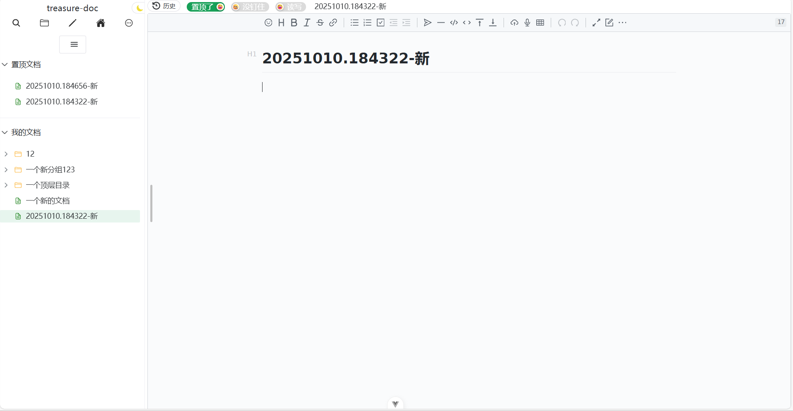
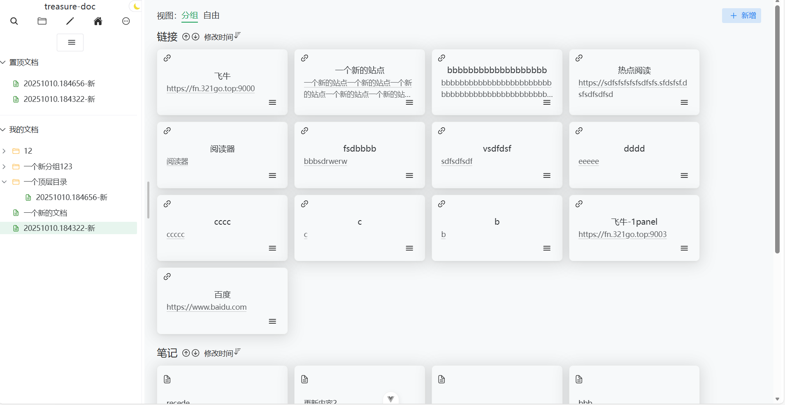
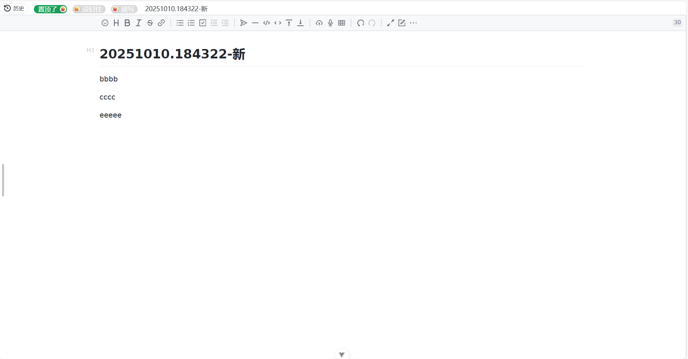
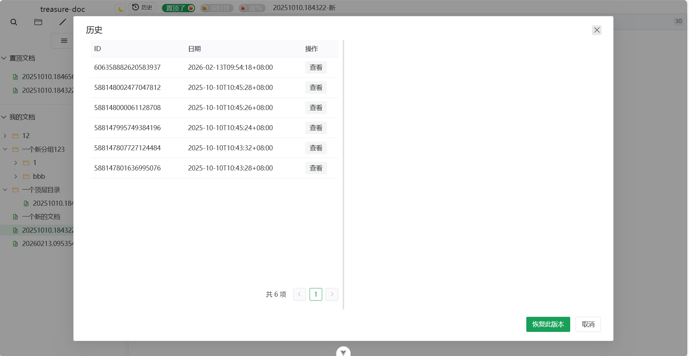
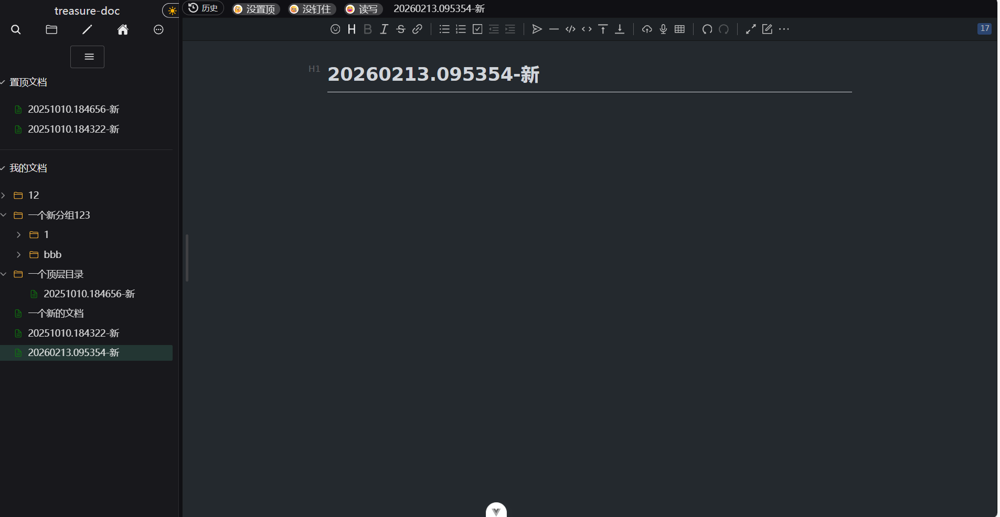

# Treasure Doc 前端

Treasure Doc 是一个基于 Vue3 和 Naive UI 框架开发的文档管理前端应用。

## 项目预览

### 主页界面


### 仪表板


### 全屏模式


### 历史记录


### 深色主题


## Project setup
```
pnpm -i
```

### Compiles and hot-reloads for development
```
pnpm dev
```

### Compiles and minifies for production
```
pnpm build
```

### Customize configuration

## 许可证

本项目采用 MIT 许可证 - 查看 [LICENSE](LICENSE) 文件了解详情。
